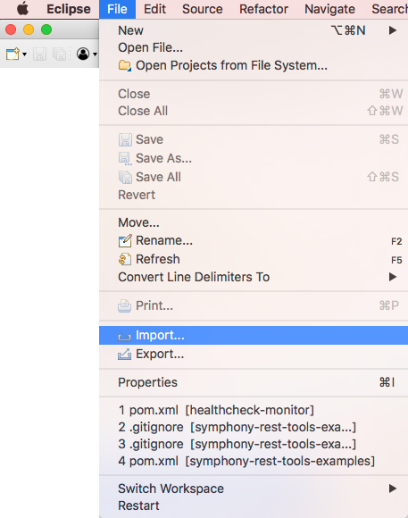
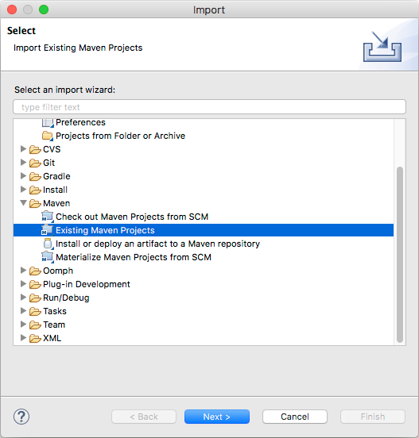
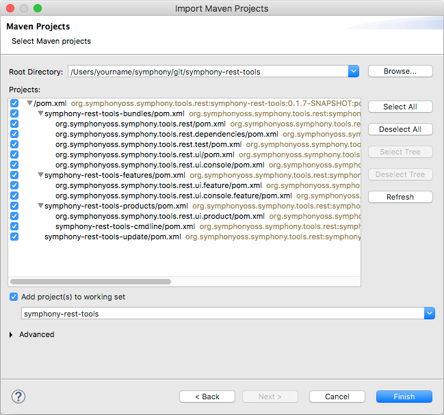
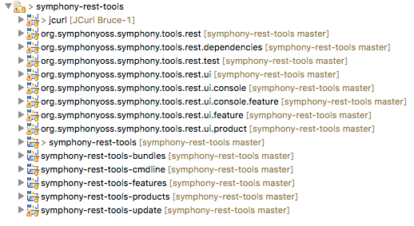

# Building
This project uses maven as its build manager.

## Eclipse, Maven and Tycho
**symphony-rest-tools** delivers both a pure Java command line tool set and library distributed via **Maven**, and an **Eclipse E4** based GUI for Windows, Mac, and Linux computers.

The Eclipse eco-system uses OSGi for component and dependency management, which is different to and separate from, the Maven dependency management system. In order to make the build work for the OSGi based GUIs, this project uses OSGi dependency management (a.k.a. "Manifest-First" dependencies) for it's build.

The Maven Tycho plugins allow for "Manifest-First" development with Maven build automation, and despite using "Manifest-First" dependency management, this project is built and released with the usual Maven commands.

In order to allow pure java consumers to access the non-UI library through the familiar Maven dependency mechanism we also maintain "Pom-First" dependency information, which is redundant as far as the build for this project is concerned.

All of this leads to one or two "weird things" and this is why, although the project is developed fully using Eclipse, that if you simply clone the GitHub repo and import the projects into Eclipse you will see build errors. We have tried hard to ensure that none of this trips up users who just want to get the source downloaded and compiled, or to use the binary distributions. The quick start examples show you a set of commands which will get an environment up and running in a few minutes. For these reasons we **strongly advise** you to try following the examples _exactly as written_ in the first instance.

## Get The Source Code
It is possible to clone the main GitHub repo directly, but if you intend to contribute to the project eventually you will need to fork the repo and raise pull requests for your contributions.

### Clone the Main Repo
If you just want to look around then you can clone the main repo directly with the following commands

```
$ mkdir /some/convenient/directory
$ cd /some/convenient/directory
$ git clone https://github.com/symphonyoss/symphony-rest-tools.git
Cloning into 'symphony-rest-tools'...
remote: Counting objects: 1955, done.
remote: Compressing objects: 100% (70/70), done.
remote: Total 1955 (delta 59), reused 65 (delta 25), pack-reused 1854
Receiving objects: 100% (1955/1955), 3.23 MiB | 411.00 KiB/s, done.
Resolving deltas: 100% (1045/1045), done.
$ cd symphony-rest-tools/
$ ls
CONTRIBUTING.md                                         pom.xml
LICENSE                                                 symphony-rest-tools-bundles
NOTICE                                                  symphony-rest-tools-features
README.md                                               symphony-rest-tools-products
docs                                                    symphony-rest-tools-update
$ 
```

### Fork the Repo
If you want to be able to contribute to the project then you can fork the repo.
In your web browser, navigate to https://github.com/symphonyoss/symphony-rest-tools and click the 
**Fork** button in the top right hand corner.


Now you can clone your fork with the following commands, replace **yourname** with your GitHub user name:

```
$ mkdir /some/convenient/directory
$ cd /some/convenient/directory
$ git clone https://github.com/yourname/symphony-rest-tools.git
Cloning into 'symphony-rest-tools'...
remote: Counting objects: 1955, done.
remote: Compressing objects: 100% (70/70), done.
remote: Total 1955 (delta 59), reused 65 (delta 25), pack-reused 1854
Receiving objects: 100% (1955/1955), 3.23 MiB | 411.00 KiB/s, done.
Resolving deltas: 100% (1045/1045), done.
$ cd symphony-rest-tools/
$ ls
CONTRIBUTING.md                                         pom.xml
LICENSE                                                 symphony-rest-tools-bundles
NOTICE                                                  symphony-rest-tools-features
README.md                                               symphony-rest-tools-products
docs                                                    symphony-rest-tools-update
$ git remote add upstream https://github.com/symphonyoss/symphony-rest-tools.git
$ git remote -v
origin  https://github.com/yourname/symphony-rest-tools.git (fetch)
origin  https://github.com/yourname/symphony-rest-tools.git (push)
upstream        https://github.com/symphonyoss/symphony-rest-tools.git (fetch)
upstream        https://github.com/symphonyoss/symphony-rest-tools.git (push)
$ 

```

Creating the **upstream** remote will allow you to raise a pull request when you are ready to make a contribution.

## Build With Maven
**DO NOT** attempt to import the sources into your IDE at this stage, you will see build errors if you do.

Run a Maven build like this:

```
$ mvn clean package
[INFO] Scanning for projects...
Downloading: https://repo.symphony.com/artifactory/plugins-snapshot/org/eclipse/tycho/tycho-maven-plugin/1.1.0-SNAPSHOT/maven-metadata.xml
Downloading: https://oss.sonatype.org/content/repositories/snapshots/org/eclipse/tycho/tycho-maven-plugin/1.1.0-SNAPSHOT/maven-metadata.xml
[INFO] ------------------------------------------------------------------------
[INFO] Reactor Build Order:
[INFO]
[INFO] Symphony REST tools
[INFO] symphony-rest-tools-bundles
[INFO] org.symphonyoss.symphony.tools.rest.dependencies
[INFO] org.symphonyoss.symphony.tools.rest
[INFO] org.symphonyoss.symphony.tools.rest.test
[INFO] org.symphonyoss.symphony.tools.rest.ui.console
[INFO] org.symphonyoss.symphony.tools.rest.ui
[INFO] symphony-rest-tools-features
[INFO] org.symphonyoss.symphony.tools.rest.ui.feature
[INFO] org.symphonyoss.symphony.tools.rest.ui.console.feature
[INFO] symphony-rest-tools-products
[INFO] org.symphonyoss.symphony.tools.rest.ui.product
[INFO] symphony-rest-tools-cmdline
[INFO] symphony-rest-tools-update
[INFO]
```
If this is your first build then you will see many more **Downloading:** lines. Following the snippet above there will be many lines of log output, the following snippet shows the construction of the various platform specific binary zips: 

```
[INFO] --- tycho-p2-director-plugin:1.1.0-SNAPSHOT:archive-products (archive-products) @ org.symphonyoss.symphony.tools.rest.ui.product ---
[INFO] Building zip: /Users/yourname/git/symphony-rest-tools/symphony-rest-tools-products/org.symphonyoss.symphony.tools.rest.ui.product/target/products/srt-linux.gtk.x86.zip
[INFO] Building zip: /Users/yourname/git/symphony-rest-tools/symphony-rest-tools-products/org.symphonyoss.symphony.tools.rest.ui.product/target/products/srt-linux.gtk.x86_64.zip
[INFO] Building zip: /Users/yourname/git/symphony-rest-tools/symphony-rest-tools-products/org.symphonyoss.symphony.tools.rest.ui.product/target/products/srt-win32.win32.x86.zip
[INFO] Building zip: /Users/yourname/git/symphony-rest-tools/symphony-rest-tools-products/org.symphonyoss.symphony.tools.rest.ui.product/target/products/srt-win32.win32.x86_64.zip
[INFO] Building zip: /Users/yourname/git/symphony-rest-tools/symphony-rest-tools-products/org.symphonyoss.symphony.tools.rest.ui.product/target/products/srt-macosx.cocoa.x86_64.zip
```

You will also find the contents of these zip files expanded in the same location which is convenient if you wish to execute the build immediately for testing.

The snippet below shows the construction of the platform neutral command line build:

```
[INFO] --- maven-assembly-plugin:2.6:single (assemble) @ symphony-rest-tools-cmdline ---
[INFO] Reading assembly descriptor: src/main/assembly/assemble.xml
[INFO] Copying files to /Users/yourname/git/symphony-rest-tools/symphony-rest-tools-products/symphony-rest-tools-cmdline/target/symphony-rest-tools-cmdline-0.1.7-SNAPSHOT-bin
[WARNING] Assembly file: /Users/yourname/git/symphony-rest-tools/symphony-rest-tools-products/symphony-rest-tools-cmdline/target/symphony-rest-tools-cmdline-0.1.7-SNAPSHOT-bin is not a regular file (it may be a directory). It cannot be attached to the project build for installation or deployment.
[INFO] Building tar: /Users/yourname/git/symphony-rest-tools/symphony-rest-tools-products/symphony-rest-tools-cmdline/target/symphony-rest-tools-cmdline-0.1.7-SNAPSHOT-bin.tar.gz
```

Finally, if all goes well, you will see this completion message:

```
[INFO] ------------------------------------------------------------------------
[INFO] Reactor Summary:
[INFO]
[INFO] Symphony REST tools ................................ SUCCESS [  0.494 s]
[INFO] symphony-rest-tools-bundles ........................ SUCCESS [  0.019 s]
[INFO] org.symphonyoss.symphony.tools.rest.dependencies ... SUCCESS [  2.479 s]
[INFO] org.symphonyoss.symphony.tools.rest ................ SUCCESS [ 14.592 s]
[INFO] org.symphonyoss.symphony.tools.rest.test ........... SUCCESS [  0.240 s]
[INFO] org.symphonyoss.symphony.tools.rest.ui.console ..... SUCCESS [  1.294 s]
[INFO] org.symphonyoss.symphony.tools.rest.ui ............. SUCCESS [  2.131 s]
[INFO] symphony-rest-tools-features ....................... SUCCESS [  0.013 s]
[INFO] org.symphonyoss.symphony.tools.rest.ui.feature ..... SUCCESS [  0.485 s]
[INFO] org.symphonyoss.symphony.tools.rest.ui.console.feature SUCCESS [  0.058 s]
[INFO] symphony-rest-tools-products ....................... SUCCESS [  0.010 s]
[INFO] org.symphonyoss.symphony.tools.rest.ui.product ..... SUCCESS [ 19.090 s]
[INFO] symphony-rest-tools-cmdline ........................ SUCCESS [  1.509 s]
[INFO] symphony-rest-tools-update ......................... SUCCESS [  1.233 s]
[INFO] ------------------------------------------------------------------------
[INFO] BUILD SUCCESS
[INFO] ------------------------------------------------------------------------
[INFO] Total time: 01:14 min
[INFO] Finished at: 2017-10-20T07:28:03+01:00
[INFO] Final Memory: 131M/1350M
[INFO] ------------------------------------------------------------------------
```

## Import into Eclipse
While you could use another IDE, the symphony-rest-tools UI is based an Eclipse E4 RCP application so the development support provided by Eclipse makes this the best choice in this case.

From the Eclipse menu, select File/Import



and then **Existing Maven Projects**



on the next page navigate to the directory where you cloned the GitHub repo and select all projects:



When the import has completed you should see the following list of projects in the Project Explore view:

