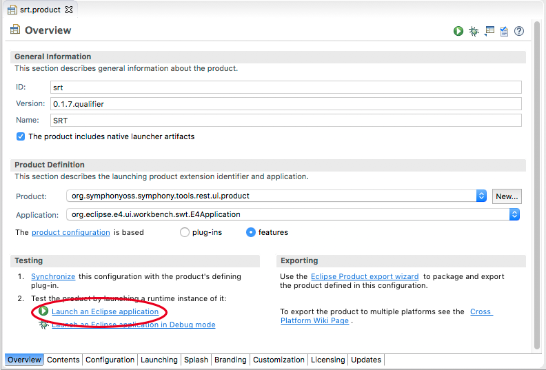
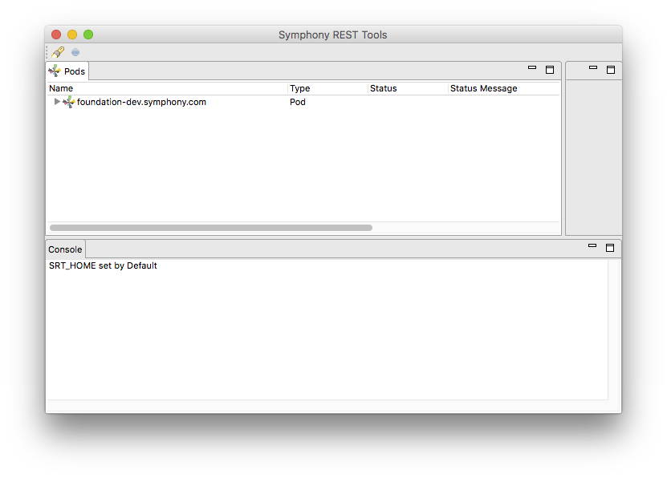
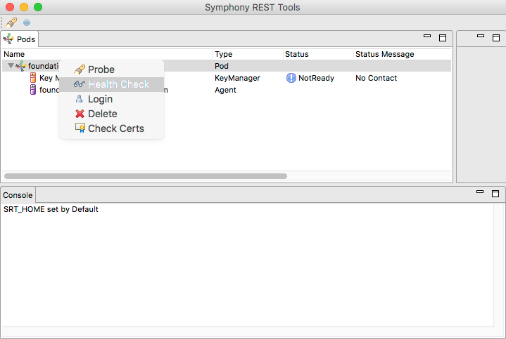
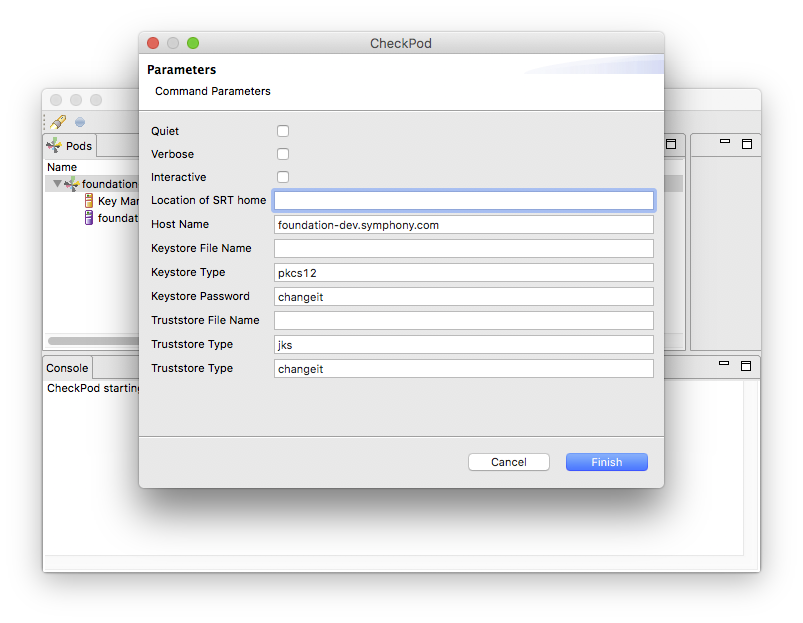
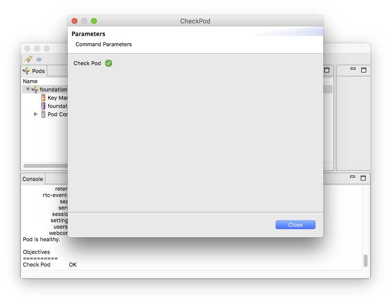
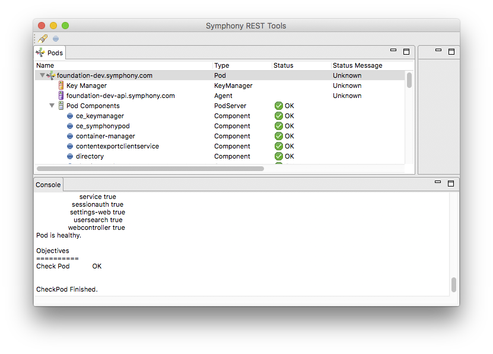

# Launch the GUI
Open the **org.symphonyoss.symphony.tools.rest.ui.product** project and in the root folder navigate to the **srt.product** file. Double click to open the file

Click on the **Launch an Eclipse application** link. The splash screen will appear momentarily and then the GUI should appear, like this:

The Pods View, in the top left, shows a list of all known Pod Configurations. The configuration which we previously discovered by running the Probe Pod command is shown here.

The Console View, at the bottom, is where command line output from commands will appear.

Open the foundation-dev config and right click to select **Health Check**

A wizard dialog will open, with a form to enter all required an optional parameters. The values previously entered will be offered as defaults except where a selection in the UI overrides them. In this example we right clicked on the **foundation-dev** pod so that name replaces the host name from the previous run.

The command then runs, a progress bar is displayed although you may not notice it in this case as the Healthcheck command is currently quite brief. Once the command is complete, a page showing all the command objectives and their outcomes is displayed:

In this case there is a single objective, and all being well, it will show a successful result like the screen shot above.

If you close the wizard dialog you may notice that a new **Pod Components** item has been added to the model in the Pods View, if you open this element you will see the reported status of components from the /HealthCheck endpoint on the pod API. 

